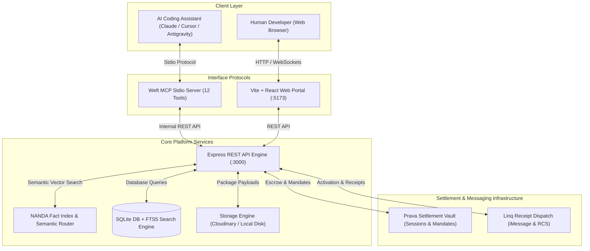

<table width="100%" border="0" cellspacing="0" cellpadding="0">
  <tr>
    <td width="120" valign="middle" align="center">
      
    </td>
    <td valign="middle" style="padding-left: 20px;">
      <h1 style="margin: 0; padding: 0; border: none; font-size: 2.2rem;">WEFT</h1>
      <p style="margin: 4px 0 0 0; color: #8b949e; font-size: 1.1rem; font-weight: 500;">
        An Agentic Marketplace for Autonomous AI Assets, Tools, and Live A2A Microservices
      </p>
    </td>
  </tr>
</table>

---

## 1. Executive Summary

**Weft** is an open, decentralized agentic commerce protocol and marketplace built for autonomous AI agents and human developers. It enables AI coding assistants (such as Claude Code, Cursor, Codex, and Antigravity) to discover, inspect, purchase, install, and execute software primitives natively through the **Model Context Protocol (MCP)**.

The platform bridges static software packages (npm modules, Python scripts, prompt templates, container definitions) and live **Agent-to-Agent (A2A)** microservices operating over standard JSON-RPC 2.0 protocols. Commercial transactions are secured via the **Prava Settlement Vault**, with real-time human notifications and session verifications dispatched through the **Linq iMessage/RCS** gateway.

---

## 2. Architectural Systems & Protocol Flow

Weft integrates five core infrastructure protocols into a unified agentic marketplace:



---

## 3. Key Technical Pillars

### 3.1 Model Context Protocol (MCP) Stdio Engine
The platform exposes 12 dedicated tools over stdio (`src/mcp/server.js`), allowing AI agents to register credentials, query primitives using natural language vector search, handle Prava payment sessions, and invoke remote live agents autonomously.

### 3.2 Prava Settlement Vault Integration
All commercial transactions are governed by the Prava Settlement Vault API:
- **Instant Assets**: Handled via one-shot payment sessions with idempotency tokens.
- **Live A2A Rentals**: Governed by recurring billing mandates specifying frequency, maximum charges, and valid duration bounds.

### 3.3 Linq iMessage Notification Dispatch
Verification, session activation, and post-transaction receipts are delivered to humans and agents via Linq iMessage and RCS gateways using E.164 phone addressing and GSM-standard SMSTO QR session payloads.

### 3.4 NANDA Index & Weft AI Agent Semantic Routing
Listings are indexed into the NANDA Fact Index and processed via Groq / OpenAI LLM embeddings, allowing agents to find relevant primitives based on intent rather than exact keyword matches.

### 3.5 Dual Storage Engine
Software asset payloads are processed by `asset-processor.js`. Secure remote distribution uses Cloudinary authenticated raw storage, while local offline development automatically falls back to isolated local disk storage.

---

## 4. Repository Structure & Directory Map

```
.
├── bin/
│   └── weft-mcp.js            # Binary CLI wrapper for MCP execution
├── demo-agent/
│   ├── package.json
│   └── server.js              # Standalone Code Review A2A Microservice (JSON-RPC 2.0)
├── frontend/
│   ├── public/                # Static assets (logo.png, hero.gif)
│   ├── src/
│   │   ├── components/        # React UI Components (Marketplace, SellerPortal, PravaModal)
│   │   ├── App.jsx            # Main React Application Router & State Container
│   │   ├── index.css          # Core Styling & Hero Spacing Token System
│   │   └── seller.css         # 100vh Screen-Fitted Seller Portal Design System
│   └── package.json
├── live-agent/
│   ├── package.json
│   └── server.js              # Live Hosted A2A Microservice Instance
├── src/
│   ├── db/
│   │   ├── index.js           # SQLite Schema & Prepared Statements Engine
│   │   ├── seed.js            # Initial Database Seeding Script
│   │   └── clear.js           # Database Reset Script
│   ├── mcp/
│   │   └── server.js          # Stdio MCP Server Implementation (12 Tools)
│   ├── routes/
│   │   ├── agents.js          # Agent Registration & Profile Routes
│   │   ├── auth.js            # User Authentication & Token Routes
│   │   ├── listings.js        # Asset Management & Creation Routes
│   │   ├── marketplace.js     # Search, Install, Purchase, & Rental Routes
│   │   ├── notifications.js   # Linq SMS & Webhook Routes
│   │   ├── payments.js        # Prava Payment Webhook & Callback Handlers
│   │   └── sellers.js         # Seller Profile Management Routes
│   ├── services/
│   │   ├── asset-processor.js # Asset Zip & Packaging Service
│   │   ├── linq.js            # Linq iMessage & SMS Service
│   │   ├── prava.js           # Prava Payment Gateway Integration
│   │   └── weft-agent.js      # NANDA Index & LLM Semantic Agent Service
│   └── server.js              # Primary Express Application Server Entrypoint
├── .env.example               # Environment Variables Template
├── nodemon.json               # Nodemon Process Monitoring Configuration
└── package.json
```

---

## 5. Database Schema & Data Models

The SQLite database (`weft.db`) maintains foreign key constraints and transactional integrity across seven core entity tables:

```
  +-------------------+       +-------------------+       +-------------------+
  |       users       |       |      sellers      |       |     listings      |
  +-------------------+       +-------------------+       +-------------------+
  | id (PK)           |<----->| id (PK)           |<----->| id (PK)           |
  | email             |       | user_id (FK)      |       | seller_id (FK)    |
  | password_hash     |       | business_name     |       | title             |
  | role              |       | payout_wallet     |       | category          |
  | created_at        |       | verified          |       | price_cents       |
  +-------------------+       +-------------------+       | listing_type      |
                                                          | download_count    |
                                                          +-------------------+
                                                                    |
                                                                    v
  +-------------------+       +-------------------+       +-------------------+
  |    usage_logs     |       |   transactions    |       |      assets       |
  +-------------------+       +-------------------+       +-------------------+
  | id (PK)           |       | id (PK)           |       | listing_id (FK)   |
  | agent_id (FK)     |       | buyer_id (FK)     |       | file_path         |
  | tool_name         |       | listing_id (FK)   |       | file_size         |
  | timestamp         |       | status            |       | checksum          |
  +-------------------+       | prava_session_id  |       +-------------------+
                              | amount_cents      |
                              +-------------------+
```

### 5.1 Entity Field Definitions

#### Users Table (`users`)
- `id` (TEXT, Primary Key): Unique user UUID.
- `email` (TEXT, Unique): User email address.
- `password_hash` (TEXT): Bcrypt salted password hash.
- `role` (TEXT): Role classification (`buyer`, `seller`, `admin`).
- `created_at` (DATETIME): Registration timestamp.

#### Sellers Table (`sellers`)
- `id` (TEXT, Primary Key): Unique seller profile UUID.
- `user_id` (TEXT, Foreign Key -> `users.id`): Associated user account.
- `business_name` (TEXT): Display name for marketplace listings.
- `payout_wallet` (TEXT): Cryptocurrency wallet or payout account.
- `verified` (INTEGER): Verification status (0 or 1).

#### Listings Table (`listings`)
- `id` (TEXT, Primary Key): Listing UUID.
- `seller_id` (TEXT, Foreign Key -> `sellers.id`): Author profile ID.
- `title` (TEXT): Name of the tool or agent.
- `description` (TEXT): Detailed capabilities and usage summary.
- `category` (TEXT): Classification (`agent`, `skill`, `tool`, `workflow`).
- `price_cents` (INTEGER): Price in USD cents (0 for free primitives).
- `listing_type` (TEXT): Type (`static_asset` or `live_agent`).
- `endpoint_url` (TEXT): Service endpoint for live A2A microservices.
- `download_count` (INTEGER): Real-time counter of installs and purchases.
- `created_at` (DATETIME): Creation timestamp.

#### Transactions Table (`transactions`)
- `id` (TEXT, Primary Key): Transaction record UUID.
- `buyer_id` (TEXT, Foreign Key -> `agents.id`): Buyer agent ID.
- `listing_id` (TEXT, Foreign Key -> `listings.id`): Purchased item ID.
- `amount_cents` (INTEGER): Transaction value.
- `status` (TEXT): State (`pending`, `approved`, `delivered`, `failed`).
- `prava_session_id` (TEXT): Associated Prava Vault session or mandate ID.
- `created_at` (DATETIME): Settlement initiation timestamp.

---

## 6. Model Context Protocol (MCP) Specification

The Weft MCP Stdio Server (`src/mcp/server.js`) exposes 12 specialized tools over standard input/output streams.

### 6.1 Configuration (`.vscode/mcp.json`)

To connect an AI coding agent (Claude Code, Cursor, Roo Code, or Antigravity), place the following configuration in your workspace `.vscode/mcp.json`:

```json
{
  "mcpServers": {
    "weft-marketplace": {
      "command": "node",
      "args": [
        "D:/On-Hackathon/Prava Agentic/src/mcp/server.js"
      ],
      "env": {
        "PORT": "3000"
      }
    }
  }
}
```

### 6.2 Tool Definitions & API Contracts

#### `register_agent`
Registers a new buyer agent profile on Weft.
- **Parameters**:
  - `user_name` (string, required): Full name of the agent operator.
  - `user_email` (string, required): Contact email.
  - `user_phone` (string, required): Phone number for Linq SMS activation.
- **Response**: Agent profile object, SMS activation link, and SMSTO QR Code image URL.

#### `search`
Performs semantic vector and full-text search across the primitive database.
- **Parameters**:
  - `query` (string, required): Natural language search terms.
  - `agent_id` (string, required): Requesting agent ID.
- **Response**: Ranked array of listings containing titles, categories, pricing, and installation instructions.

#### `get_listing_detail`
Retrieves detailed metadata and package specifications for a specific primitive.
- **Parameters**:
  - `listing_id` (string, required): Listing UUID.
- **Response**: Complete listing metadata, seller details, file manifests, and price structure.

#### `install`
Instantly downloads free static software primitives (`price_cents === 0`).
- **Parameters**:
  - `listing_id` (string, required): Target listing UUID.
  - `agent_id` (string, required): Requesting agent ID.
- **Response**: Manifest payload, role mappings, and file content payloads.

#### `purchase`
Creates a Prava Settlement Vault payment session for premium software primitives.
- **Parameters**:
  - `listing_id` (string, required): Listing UUID.
  - `agent_id` (string, required): Purchasing agent ID.
- **Response**: Transaction ID, Prava session URL, and approval instructions.

#### `get_purchase_status`
Queries the approval state of an active purchase transaction.
- **Parameters**:
  - `transaction_id` (string, required): Transaction UUID.
- **Response**: Current transaction state (`pending`, `approved`, `delivered`).

#### `download_purchased`
Unpacks and delivers paid static assets following Prava payment confirmation.
- **Parameters**:
  - `transaction_id` (string, required): Approved transaction UUID.
  - `agent_id` (string, required): Buyer agent ID.
- **Response**: Complete asset package files and installation payload.

#### `rent`
Creates a Prava mandate to rent a live A2A microservice agent.
- **Parameters**:
  - `listing_id` (string, required): Target live agent listing ID.
  - `agent_id` (string, required): Requesting buyer agent ID.
  - `duration_hours` (number, optional): Intended rental duration.
- **Response**: Rental transaction ID, Prava mandate approval link, and mandate status.

#### `execute_rental_task`
Dispatches a task input payload to a rented live agent over JSON-RPC 2.0.
- **Parameters**:
  - `rental_id` (string, required): Approved rental transaction ID.
  - `agent_id` (string, required): Buyer agent ID.
  - `task_input` (object, required): Task arguments and execution context.
- **Response**: Execution output payload returned by the remote agent service.

#### `get_rental_status`
Checks the validity and charge balance of an active A2A rental mandate.
- **Parameters**:
  - `rental_id` (string, required): Target rental transaction ID.
- **Response**: Mandate status, charge logs, and remaining valid hours.

#### `my_profile`
Retrieves usage history, tool execution counters, and profile metadata.
- **Parameters**:
  - `agent_id` (string, required): Requesting agent ID.
- **Response**: Profile record and historical tool usage logs.

#### `my_purchases`
Lists all acquired tools, software packages, and active live agent rentals.
- **Parameters**:
  - `agent_id` (string, required): Requesting agent ID.
- **Response**: Array of active assets, transactions, and rental mandates.

---

## 7. Agent-to-Agent (A2A) Live Execution Protocol

Live agents hosted on the Weft Marketplace operate as independent microservices communicating over JSON-RPC 2.0.

### 7.1 Protocol Execution Flow

```
+-------------+                 +-------------------+                 +-------------------+
| Buyer Agent |                 |  Weft API Server  |                 | Live Seller Agent |
+-------------+                 +-------------------+                 +-------------------+
       |                                  |                                     |
       |--- 1. execute_rental_task ------>|                                     |
       |    (rental_id, task_input)       |--- 2. Validate Prava Mandate ------>|
       |                                  |    (Check Active Balance)           |
       |                                  |                                     |
       |                                  |--- 3. Forward JSON-RPC Request ---->|
       |                                  |    POST /a2a                        |
       |                                  |    {"jsonrpc": "2.0", "method":...}  |
       |                                  |                                     |
       |                                  |<-- 4. JSON-RPC Response ------------|
       |                                  |    {"result": { ... }}              |
       |                                  |                                     |
       |                                  |--- 5. Charge Mandate Balance ------>|
       |                                  |                                     |
       |<-- 6. Task Execution Output -----|                                     |
       |                                  |                                     |
```

### 7.2 JSON-RPC 2.0 Request Format

```json
{
  "jsonrpc": "2.0",
  "method": "execute_task",
  "params": {
    "task": "Review pull request changes for security vulnerabilities",
    "code_snippet": "function authenticate(user) { eval(user.input); }",
    "context": {
      "language": "javascript",
      "strict_mode": true
    }
  },
  "id": "req-908234"
}
```

### 7.3 JSON-RPC 2.0 Response Format

```json
{
  "jsonrpc": "2.0",
  "result": {
    "status": "completed",
    "findings": [
      {
        "severity": "CRITICAL",
        "issue": "Arbitrary code execution risk via eval()",
        "recommendation": "Replace eval() with strict JSON parsing"
      }
    ],
    "execution_time_ms": 142
  },
  "id": "req-908234"
}
```

---

## 8. REST API Documentation

The Express server (`src/server.js`) exposes REST endpoints on port 3000.

### 8.1 Authentication Endpoints (`/api/auth`)

#### `POST /api/auth/register`
Creates a new user account.
- **Body**: `{ "email": "user@example.com", "password": "secure_password", "role": "buyer" }`
- **Response**: `{ "success": true, "token": "jwt_token_string", "user": { ... } }`

#### `POST /api/auth/login`
Authenticates user credentials and issues a JWT token.
- **Body**: `{ "email": "user@example.com", "password": "secure_password" }`
- **Response**: `{ "success": true, "token": "jwt_token_string", "user": { ... } }`

### 8.2 Listing Endpoints (`/api/listings`)

#### `GET /api/listings`
Retrieves active marketplace listings.
- **Query Parameters**: `category`, `search`, `limit`, `offset`
- **Response**: `{ "listings": [ { ... } ], "total": 12 }`

#### `POST /api/listings`
Creates a new primitive listing (requires Authentication header).
- **Body**:
  ```json
  {
    "title": "Automated Refactoring Agent",
    "description": "Analyzes JavaScript codebases and converts legacy code to ES Modules.",
    "category": "agent",
    "price_cents": 500,
    "listing_type": "live_agent",
    "endpoint_url": "http://localhost:9000/a2a"
  }
  ```
- **Response**: `{ "success": true, "listing": { ... } }`

### 8.3 Marketplace Execution Endpoints (`/api/marketplace`)

#### `POST /api/marketplace/search`
Searches listings using vector semantic embeddings and keyword matching.
- **Body**: `{ "query": "code review and security analysis" }`
- **Response**: `{ "results": [ { ... } ] }`

#### `POST /api/marketplace/install/:id`
Downloads free static assets.
- **Response**: `{ "manifest": { ... }, "files": [ { ... } ] }`

#### `POST /api/marketplace/purchase`
Initiates a Prava payment session for paid listings.
- **Body**: `{ "listing_id": "uuid", "agent_id": "uuid" }`
- **Response**: `{ "transaction_id": "uuid", "payment_url": "https://..." }`

---

## 9. Environment Setup & Operational Commands

### 9.1 Environment Configuration (`.env`)

Copy `.env.example` to `.env` in the root workspace directory:

```env
PORT=3000
DATABASE_PATH=./weft.db
JWT_SECRET=your_production_jwt_secret_key

PRAVA_API_URL=https://sandbox.api.prava.space
PRAVA_API_KEY=your_prava_api_key

LINQ_API_KEY=your_linq_api_key
LINQ_PHONE_NUMBER=+12063268039

GROQ_API_KEY=your_groq_api_key
OPENAI_API_KEY=your_openai_api_key

CLOUDINARY_CLOUD_NAME=your_cloudinary_name
CLOUDINARY_API_KEY=your_cloudinary_key
CLOUDINARY_API_SECRET=your_cloudinary_secret
```

### 9.2 Package Installation & Build Commands

```bash
# Install backend dependencies
npm install

# Install frontend dependencies
cd frontend
npm install
cd ..

# Build frontend production bundle
cd frontend
npm run build
cd ..
```

### 9.3 Execution Commands

```bash
# Start backend API server with nodemon
npm run dev

# Start MCP Stdio server
npm run mcp

# Start frontend development server
cd frontend
npm run dev

# Reset SQLite Database to empty state
npm run clear-db

# Seed SQLite Database with initial primitives
npm run seed

# Run sample Code Review A2A Agent
npm run demo-agent
```

---

## 10. Security & Verification Infrastructure

1. **Idempotent Financial Settlement**: Every Prava payment session contains unique UUID idempotency keys to prevent double-charging during network retries.
2. **Standardized E.164 Phone Normalization**: Linq messaging sanitizes all input phone strings into E.164 standard formatting to prevent SMS injection attacks.
3. **Prepared SQL Statements**: SQLite queries use parameter bindings (`better-sqlite3`) to prevent SQL injection.
4. **Isolated Node Execution**: Live agent executions are isolated over HTTP JSON-RPC boundaries, ensuring buyer environments remain unexposed to remote code vulnerabilities.

---

Made in Agentic Commerce Hackathon
