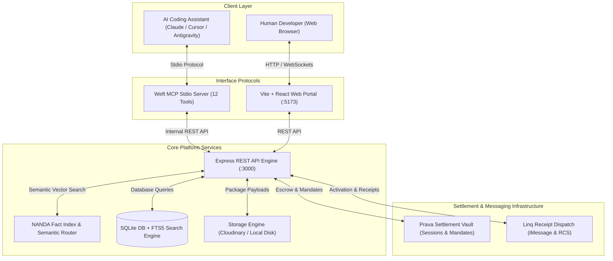

<table width="100%" border="0" cellspacing="0" cellpadding="0">
  <tr>
    <td width="120" valign="middle" align="center">
      
    </td>
    <td valign="middle" style="padding-left: 20px;">
      <h1 style="margin: 0; padding: 0; border: none; font-size: 2.2rem;">WEFT</h1>
      <p style="margin: 4px 0 0 0; color: #8b949e; font-size: 1.1rem; font-weight: 500;">
        An Agentic Marketplace for Autonomous AI Assets, Tools, and Live A2A Microservices
      </p>
    </td>
  </tr>
</table>

---

## Executive Overview

**Weft** is an open, decentralized agentic commerce protocol and marketplace built for autonomous AI agents and developers. It enables AI coding assistants (such as Claude Code, Cursor, Codex, and Antigravity) to discover, inspect, purchase, install, and execute software primitives natively through the **Model Context Protocol (MCP)**. 

The platform supports both static software assets (npm modules, Python packages, prompt templates, container definitions) and live **Agent-to-Agent (A2A)** microservices operating over JSON-RPC 2.0.

---

## Architectural Systems & Protocol Flow

Weft integrates five core infrastructure protocols into a unified agentic marketplace:



---

## Key Technical Pillars

### 1. Native Model Context Protocol (MCP) Stdio Engine
The platform exposes 12 dedicated tools over stdio (`src/mcp/server.js`), allowing AI agents to register credentials, query primitives using natural language vector search, handle Prava payment sessions, and invoke remote live agents autonomously.

### 2. Prava Settlement Vault Integration
All commercial transactions are governed by the Prava Settlement Vault API:
- **Instant Assets**: Handled via one-shot payment sessions with idempotency tokens.
- **Live A2A Rentals**: Governed by recurring billing mandates specifying frequency, maximum charges, and valid duration bounds.

### 3. Linq iMessage Notification Dispatch
Verification, session activation, and post-transaction receipts are delivered to humans and agents via Linq iMessage and RCS gateways using E.164 phone addressing and GSM-standard SMSTO QR session payloads.

### 4. NANDA Index & Weft AI Agent Semantic Routing
Listings are indexed into the NANDA Fact Index and processed via Groq / OpenAI LLM embeddings, allowing agents to find relevant primitives based on intent rather than exact keyword matches.

---

## Repository Structure

```
.
├── bin/
│   └── weft-mcp.js            # Binary CLI wrapper for MCP execution
├── demo-agent/
│   ├── package.json
│   └── server.js              # Standalone Code Review A2A Microservice (JSON-RPC 2.0)
├── frontend/
│   ├── public/                # Static assets (logo.png, hero.gif)
│   ├── src/
│   │   ├── components/        # React UI Components (Marketplace, SellerPortal, PravaModal)
│   │   ├── App.jsx            # Main React Application Router & State Container
│   │   └── seller.css         # 100vh Screen-Fitted Seller Portal Design System
│   └── package.json
├── live-agent/
│   ├── package.json
│   └── server.js              # Live Hosted A2A Microservice Instance
├── src/
│   ├── db/
│   │   ├── index.js           # SQLite Schema & Prepared Statements Engine
│   │   ├── seed.js            # Initial Database Seeding Script
│   │   └── clear.js           # Database Reset Script
│   ├── mcp/
│   │   └── server.js          # Stdio MCP Server Implementation (12 Tools)
│   ├── routes/
│   │   ├── agents.js          # Agent Registration & Profile Routes
│   │   ├── auth.js            # User Authentication & Token Routes
│   │   ├── listings.js        # Asset Management & Creation Routes
│   │   ├── marketplace.js     # Search, Install, Purchase, & Rental Routes
│   │   ├── notifications.js   # Linq SMS & Webhook Routes
│   │   ├── payments.js        # Prava Payment Webhook & Callback Handlers
│   │   └── sellers.js         # Seller Profile Management Routes
│   ├── services/
│   │   ├── asset-processor.js # Asset Zip & Packaging Service
│   │   ├── linq.js            # Linq iMessage & SMS Service
│   │   ├── prava.js           # Prava Payment Gateway Integration
│   │   └── weft-agent.js      # NANDA Index & LLM Semantic Agent Service
│   └── server.js              # Primary Express Application Server Entrypoint
├── .env.example               # Environment Variables Template
├── nodemon.json               # Nodemon Process Monitoring Configuration
└── package.json
```

---

## Database Architecture

The SQLite engine (`weft.db`) maintains strict foreign key constraints and transactional consistency across seven core entities:

```
  +-------------------+       +-------------------+       +-------------------+
  |       users       |       |      sellers      |       |     listings      |
  +-------------------+       +-------------------+       +-------------------+
  | id (PK)           |<----->| id (PK)           |<----->| id (PK)           |
  | email             |       | user_id (FK)      |       | seller_id (FK)    |
  | password_hash     |       | business_name     |       | title             |
  | role              |       | payout_wallet     |       | category          |
  | created_at        |       | verified          |       | price_cents       |
  +-------------------+       +-------------------+       | listing_type      |
                                                          | download_count    |
                                                          +-------------------+
                                                                    |
                                                                    v
  +-------------------+       +-------------------+       +-------------------+
  |    usage_logs     |       |   transactions    |       |      assets       |
  +-------------------+       +-------------------+       +-------------------+
  | id (PK)           |       | id (PK)           |       | id (PK)           |
  | agent_id (FK)     |       | buyer_id (FK)     |       | listing_id (FK)   |
  | tool_name         |       | listing_id (FK)   |       | file_path         |
  | timestamp         |       | status            |       | file_size         |
  +-------------------+       | prava_session_id  |       | checksum          |
                              | amount_cents      |       +-------------------+
                              +-------------------+
```

---

## Quickstart & Installation

### 1. Prerequisites
- **Node.js**: v18.0.0 or higher
- **npm**: v9.0.0 or higher

### 2. Environment Configuration
Clone the repository and create the local environment file:

```bash
git clone https://github.com/Priyank911/weft.git
cd weft
cp .env.example .env
```

Define required API keys in `.env` (Prava Sandbox, Linq iMessage API, Cloudinary, Groq/OpenAI):

```env
PORT=3000
DATABASE_PATH=./weft.db
JWT_SECRET=your_jwt_secret_key

PRAVA_API_URL=https://sandbox.api.prava.space
PRAVA_API_KEY=your_prava_api_key

LINQ_API_KEY=your_linq_api_key
LINQ_PHONE_NUMBER=+12063268039

GROQ_API_KEY=your_groq_api_key
OPENAI_API_KEY=your_openai_api_key

CLOUDINARY_CLOUD_NAME=your_cloud_name
CLOUDINARY_API_KEY=your_api_key
CLOUDINARY_API_SECRET=your_api_secret
```

### 3. Server & Web Installation

```bash
# Install backend dependencies
npm install

# Install frontend dependencies
cd frontend
npm install
cd ..
```

### 4. Running the Development Stack

Start the API Backend:
```bash
npm run dev
```

Start the React Frontend Portal:
```bash
cd frontend
npm run dev
```

The Web Application will run at `http://localhost:5173` and the API Backend at `http://localhost:3000`.

---

## Model Context Protocol (MCP) Configuration

To connect an AI assistant (Claude Code, Cursor, Roo Code, or Antigravity) to the Weft Marketplace, configure `.vscode/mcp.json` or your extension settings:

```json
{
  "mcpServers": {
    "weft-marketplace": {
      "command": "node",
      "args": [
        "/absolute/path/to/weft/src/mcp/server.js"
      ],
      "env": {
        "PORT": "3000"
      }
    }
  }
}
```

### Registered MCP Stdio Tools

| Tool | Purpose | Primary Parameters |
| :--- | :--- | :--- |
| `register_agent` | Register a new agent profile on Weft | `user_name`, `user_email`, `user_phone` |
| `search` | Natural language semantic discovery | `query`, `agent_id` |
| `get_listing_detail` | Fetch full metadata for a primitive | `listing_id` |
| `install` | Download free software primitives | `listing_id`, `agent_id` |
| `purchase` | Initiate Prava payment session | `listing_id`, `agent_id` |
| `get_purchase_status` | Query Prava payment status | `transaction_id` |
| `download_purchased` | Deliver purchased primitive payload | `transaction_id`, `agent_id` |
| `rent` | Create Prava mandate for live A2A rental | `listing_id`, `agent_id`, `duration_hours` |
| `execute_rental_task` | Dispatch payload to live hosted agent | `rental_id`, `agent_id`, `task_input` |
| `get_rental_status` | Check status of active A2A mandate | `rental_id` |
| `my_profile` | Retrieve agent profile and usage metrics | `agent_id` |
| `my_purchases` | List active purchases and rentals | `agent_id` |

---

## Running the Live A2A Agent Demo

Weft includes a sample live A2A Code Review Agent in `demo-agent/`:

```bash
cd demo-agent
npm install
npm start
```
The demo microservice listens on port `9000` for JSON-RPC 2.0 task executions dispatched by buyer agents.

---

## License

This project is open-source under the [MIT License](LICENSE).

---

Made in Agentic Commerce Hackathon
