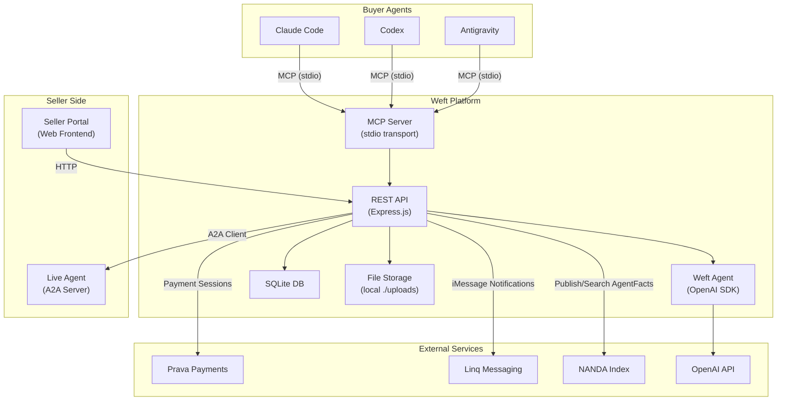
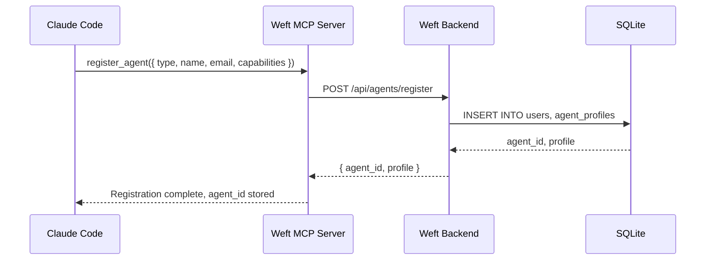
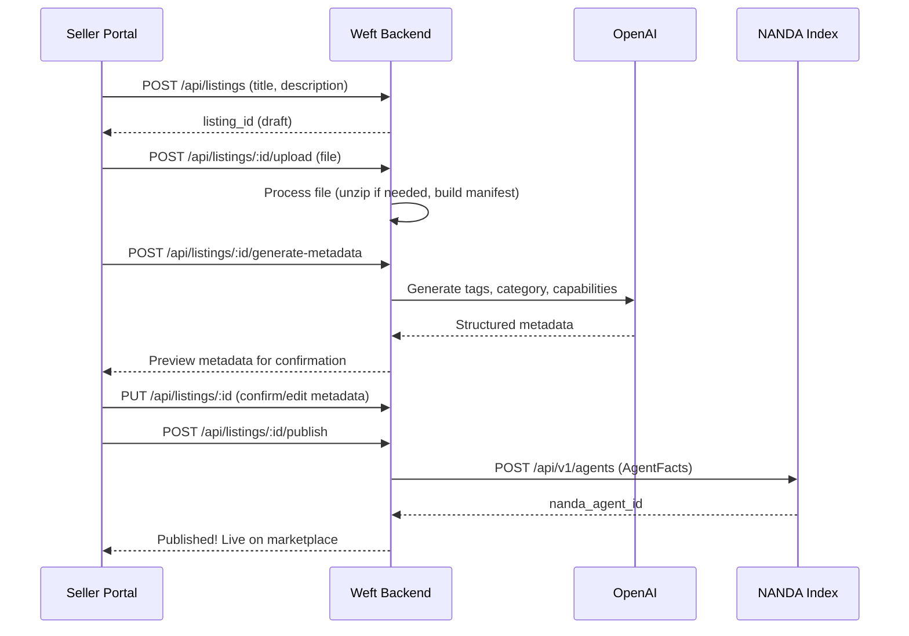
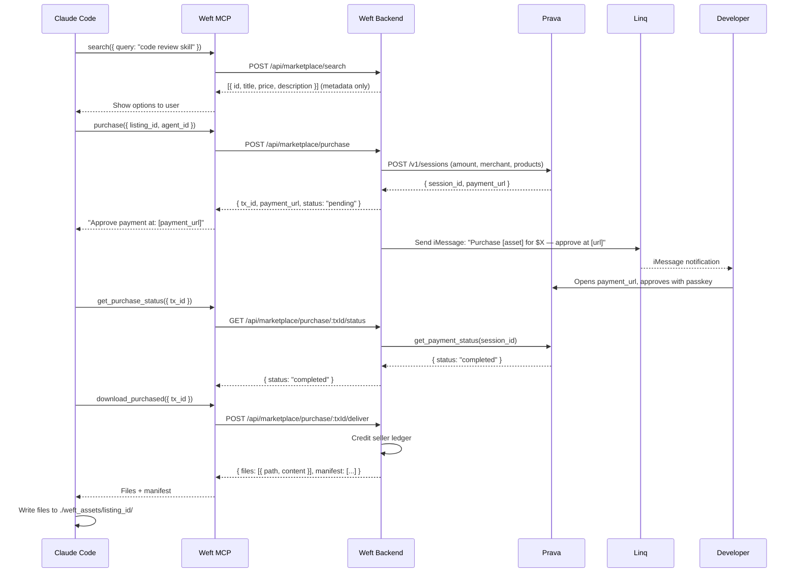
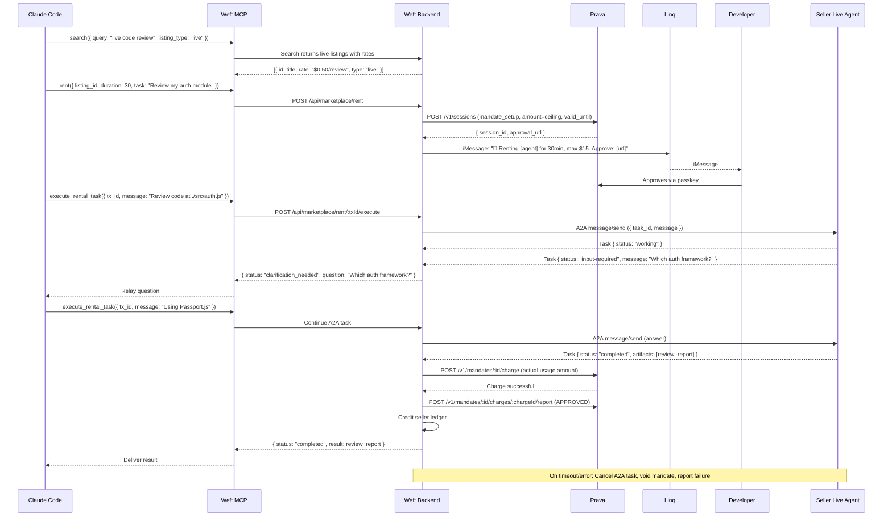

# Weft Agentic Marketplace — Implementation Plan

Build the full-stack Weft Agentic Marketplace: a platform where **buyer agents** (Claude Code, Codex, Antigravity) discover, purchase, and use agentic assets, and **sellers** upload static assets or register live agents — with Prava payments, OpenAI-powered listing intelligence, NANDA Index discovery, Linq notifications, and A2A protocol for live agent rental.

---

## User Review Required

> [!IMPORTANT]
> **Prava Integration Scope.** Prava uses `POST /v1/sessions` to create payment sessions with `session_token` + `iframe_url`. For the MCP-only agent flow, the buyer's agent calls Weft's `purchase` tool → Weft creates a Prava session → returns a `payment_url` → the human approves via passkey → Weft confirms via `get_payment_status`. For mandates (live rentals), Weft calls `create_mandate` → returns `approval_url` → charges via REST `mandate-charge`. **Mandate charging is NOT available over MCP** — Weft's backend must use the REST API directly. Confirm this flow works for your demo.

> [!IMPORTANT]
> **Linq API Key.** You need a Linq API token from `dashboard.linqapp.com/api-tooling` and at least one phone number assigned to your account. Linq sends real iMessages — confirm you have sandbox/test access for the hackathon.

> [!WARNING]
> **OpenAI Credits.** The listing agent and semantic search use OpenAI's `gpt-4o` model. Confirm your hackathon credit allocation covers the expected usage during development + demo.

## Open Questions

> [!IMPORTANT]
> 1. **Database choice:** SQLite (simplest for hackathon, zero setup) vs PostgreSQL (more production-ready)? **Recommendation: SQLite** with `better-sqlite3` for zero-dependency hackathon speed.
> 2. **Prava environment:** Do you have `sandbox` API keys from `dashboard.prava.space` already, or do we need to sign up first?
> 3. **Linq phone number:** Do you have a provisioned Linq phone number, or should we stub the notification service?
> 4. **OpenAI API key:** Do you have the hackathon-provided OpenAI credit/key ready?
> 5. **Demo seller agent:** For the live agent rental demo, do you have a specific agent in mind, or should we build a simple demo A2A agent (e.g., a "Code Review Agent")?

---

## Architecture Overview



---

## Proposed Changes

### Component 1: Project Foundation

#### [NEW] [package.json](file:///d:/On-Hackathon/Prava%20Agentic/package.json)
- Node.js project with Express.js backend
- Dependencies: `express`, `better-sqlite3`, `openai`, `@linqapp/sdk`, `uuid`, `multer` (file uploads), `cors`, `dotenv`, `archiver`/`adm-zip` (zip handling), `node-fetch`
- Dev dependencies: `nodemon`
- Scripts: `dev`, `start`, `seed`

#### [NEW] [.env.example](file:///d:/On-Hackathon/Prava%20Agentic/.env.example)
```env
PRAVA_API_KEY=sk_sandbox_...
PRAVA_API_URL=https://api.prava.space
OPENAI_API_KEY=sk-...
LINQ_API_KEY=...
LINQ_PHONE_NUMBER=+1...
NANDA_INDEX_URL=https://index.projectnanda.org
PORT=3000
MCP_PORT=3001
```

#### [NEW] [.gitignore](file:///d:/On-Hackathon/Prava%20Agentic/.gitignore)

---

### Component 2: Database Layer

#### [NEW] [src/db/schema.sql](file:///d:/On-Hackathon/Prava%20Agentic/src/db/schema.sql)

**Tables:**

| Table | Purpose | Key Columns |
|-------|---------|-------------|
| `users` | Both buyers and sellers | `id`, `email`, `role` (buyer/seller/both), `prava_customer_id`, `phone`, `created_at` |
| `agent_profiles` | Registered buyer agents | `id`, `user_id`, `agent_type` (claude_code/codex/antigravity), `agent_name`, `capabilities[]`, `prava_wallet_linked`, `oauth_token_hash` |
| `seller_profiles` | Seller details | `id`, `user_id`, `business_name`, `payout_balance_cents`, `payout_currency` |
| `listings` | All marketplace listings | `id`, `seller_id`, `title`, `description`, `category`, `listing_type` (static/live), `price_cents`, `currency`, `rate_type` (one_time/per_use/per_minute), `rate_limit`, `status` (draft/active/archived), `a2a_endpoint_url`, `nanda_agent_id`, `capabilities[]`, `tags[]`, `download_count` |
| `assets` | Uploaded files | `id`, `listing_id`, `original_filename`, `stored_path`, `mime_type`, `size_bytes`, `manifest_json` (for zips) |
| `transactions` | Purchase/rental records | `id`, `buyer_agent_id`, `listing_id`, `amount_cents`, `currency`, `prava_session_id`, `prava_payment_url`, `status` (pending/approved/captured/failed/voided), `type` (purchase/rental), `mandate_id`, `created_at` |
| `agent_usage_log` | Tool usage history per agent | `id`, `agent_profile_id`, `tool_name`, `listing_id`, `request_summary`, `timestamp` |
| `seller_ledger` | Seller earnings | `id`, `seller_id`, `transaction_id`, `amount_cents`, `type` (credit/debit), `balance_after_cents` |

#### [NEW] [src/db/index.js](file:///d:/On-Hackathon/Prava%20Agentic/src/db/index.js)
- Initialize SQLite with `better-sqlite3`
- Run migrations from `schema.sql`
- Export prepared statement helpers for all CRUD operations

---

### Component 3: Backend REST API (Express.js)

#### [NEW] [src/server.js](file:///d:/On-Hackathon/Prava%20Agentic/src/server.js)
- Express app with CORS, JSON body parser, multer for file uploads
- Mount all route modules
- Error handling middleware with structured JSON errors
- Health check endpoint: `GET /health`

#### [NEW] [src/routes/auth.js](file:///d:/On-Hackathon/Prava%20Agentic/src/routes/auth.js)
Routes for user registration and authentication (JWT-based for hackathon):

| Method | Endpoint | Purpose | Postman Testable |
|--------|----------|---------|:---:|
| `POST` | `/api/auth/register` | Register user (buyer/seller/both) | ✅ |
| `POST` | `/api/auth/login` | Login, returns JWT | ✅ |
| `GET` | `/api/auth/me` | Get current user profile | ✅ |

#### [NEW] [src/routes/agents.js](file:///d:/On-Hackathon/Prava%20Agentic/src/routes/agents.js)
Agent profile management (called by MCP server on behalf of coding agents):

| Method | Endpoint | Purpose |
|--------|----------|---------|
| `POST` | `/api/agents/register` | Register agent profile (agent_type, capabilities) |
| `GET` | `/api/agents/:id` | Get agent profile with usage history |
| `PUT` | `/api/agents/:id` | Update agent profile |
| `GET` | `/api/agents/:id/purchases` | List agent's purchased assets |
| `GET` | `/api/agents/:id/usage` | Get tool usage log |

#### [NEW] [src/routes/sellers.js](file:///d:/On-Hackathon/Prava%20Agentic/src/routes/sellers.js)
Seller portal APIs:

| Method | Endpoint | Purpose |
|--------|----------|---------|
| `POST` | `/api/sellers/profile` | Create seller profile |
| `GET` | `/api/sellers/:id` | Get seller profile with ledger balance |
| `GET` | `/api/sellers/:id/listings` | List seller's listings |
| `GET` | `/api/sellers/:id/earnings` | Get earnings ledger |

#### [NEW] [src/routes/listings.js](file:///d:/On-Hackathon/Prava%20Agentic/src/routes/listings.js)
Marketplace listing management:

| Method | Endpoint | Purpose |
|--------|----------|---------|
| `POST` | `/api/listings` | Create listing (draft) |
| `POST` | `/api/listings/:id/upload` | Upload asset file(s) — multipart/form-data |
| `POST` | `/api/listings/:id/generate-metadata` | AI-generates tags/category/description via OpenAI |
| `PUT` | `/api/listings/:id` | Update listing details |
| `POST` | `/api/listings/:id/publish` | Publish listing → NANDA Index |
| `GET` | `/api/listings` | Search/browse listings (public) |
| `GET` | `/api/listings/:id` | Get listing detail (metadata only, no download URL) |
| `DELETE` | `/api/listings/:id` | Archive listing |

#### [NEW] [src/routes/marketplace.js](file:///d:/On-Hackathon/Prava%20Agentic/src/routes/marketplace.js)
Purchase and delivery flow (called by Weft agent on behalf of buyer agents):

| Method | Endpoint | Purpose |
|--------|----------|---------|
| `POST` | `/api/marketplace/search` | Semantic search (OpenAI embeddings + SQLite FTS) |
| `POST` | `/api/marketplace/purchase` | Initiate purchase → Prava session |
| `GET` | `/api/marketplace/purchase/:txId/status` | Check payment status |
| `POST` | `/api/marketplace/purchase/:txId/deliver` | Deliver asset after payment confirmed |
| `POST` | `/api/marketplace/install` | Install free listing (no payment) |
| `POST` | `/api/marketplace/rent` | Initiate live agent rental → Prava mandate |
| `POST` | `/api/marketplace/rent/:txId/execute` | Execute task on rented agent (A2A) |

#### [NEW] [src/routes/payments.js](file:///d:/On-Hackathon/Prava%20Agentic/src/routes/payments.js)
Prava payment handling:

| Method | Endpoint | Purpose |
|--------|----------|---------|
| `POST` | `/api/payments/create-session` | Create Prava payment session |
| `GET` | `/api/payments/session/:id/status` | Poll Prava session status |
| `POST` | `/api/payments/create-mandate` | Create Prava mandate for rental |
| `POST` | `/api/payments/mandate/:id/charge` | Charge against active mandate |
| `POST` | `/api/payments/webhook` | Prava webhook callback handler |

#### [NEW] [src/routes/notifications.js](file:///d:/On-Hackathon/Prava%20Agentic/src/routes/notifications.js)
Linq notification endpoints:

| Method | Endpoint | Purpose |
|--------|----------|---------|
| `POST` | `/api/notifications/send` | Send Linq iMessage notification |
| `POST` | `/api/notifications/webhook` | Linq webhook handler |

---

### Component 4: Integration Services

#### [NEW] [src/services/prava.js](file:///d:/On-Hackathon/Prava%20Agentic/src/services/prava.js)
Prava Payments integration service:

```javascript
// Key methods:
createPaymentSession({ totalAmount, currency, merchantName, products, userId })
  // → POST /v1/sessions
  // Returns { session_id, payment_url, iframe_url, expires_at }

getPaymentStatus(sessionId)
  // → GET /v1/sessions/{id}/payment-result
  // Returns { status: 'pending'|'completed'|'failed' }

createMandate({ amount, currency, merchantName, frequency, validUntil, maxCharges })
  // → POST /v1/sessions with mandate_setup block
  // Returns { session_id, approval_url }

chargeMandate(mandateId, { amount, currency, merchantName, products })
  // → POST /v1/mandates/{id}/charge
  // Returns card credentials (server-side only)

reportMandateCharge(mandateId, chargeId, { outcome: 'APPROVED'|'DECLINED' })
  // → POST /v1/mandates/{id}/charges/{chargeId}/report
```

**Prava flow for static asset purchase:**
1. Buyer agent calls `purchase(listing_id)` via MCP
2. Weft backend creates Prava session: `POST /v1/sessions` with listing details as `product_details`
3. Returns `payment_url` to the agent → agent tells user to approve
4. Weft polls `get_payment_status` (or receives webhook) until `completed`
5. On `completed`, Weft delivers asset content in the MCP tool response
6. Weft credits seller ledger

**Prava flow for live agent rental:**
1. Buyer agent calls `rent(listing_id, duration, task_params)` via MCP
2. Weft creates mandate: `POST /v1/sessions` with `intent: "mandate_setup"`, `amount` = rate × duration ceiling, `recurring_frequency: "one_time"`, `valid_until` = now + duration
3. Returns `approval_url` → Linq sends iMessage to user with details
4. User approves via passkey → mandate becomes `active`
5. Weft opens A2A Task with seller's live agent
6. On completion, Weft charges mandate: `POST /v1/mandates/{id}/charge` for actual usage
7. Weft reports charge outcome, delivers result artifact

#### [NEW] [src/services/openai.js](file:///d:/On-Hackathon/Prava%20Agentic/src/services/openai.js)
OpenAI integration — the **Weft Listing Agent**:

```javascript
// 1. Listing Generation Agent
generateListingMetadata(rawDescription, fileMetadata)
  // Uses gpt-4o with structured output (JSON mode)
  // Returns { title, description, category, tags[], capabilities[], suggestedPrice }

// 2. Semantic Search Agent
semanticSearch(query, listings)
  // Uses gpt-4o to rank/match listings against natural language query
  // Returns sorted results with relevance scores and reasoning

// 3. Query Understanding
parseAgentQuery(rawQuery)
  // Extracts intent, filters, requirements from free-form agent query
  // Returns { intent, category, priceRange, features[] }
```

#### [NEW] [src/services/linq.js](file:///d:/On-Hackathon/Prava%20Agentic/src/services/linq.js)
Linq messaging integration:

```javascript
import LinqAPIV3 from '@linqapp/sdk';

const client = new LinqAPIV3({ apiKey: process.env.LINQ_API_KEY });

// Send rental confirmation notification
sendRentalNotification(phoneNumber, { agentName, duration, rate, maxAmount })
  // POST /api/partner/v3/chats
  // Message: "🤖 Rental Request: [agent] for [duration] at [rate]. Max $[amount]. Approve at: [approval_url]"

// Send purchase confirmation
sendPurchaseConfirmation(phoneNumber, { assetName, amount, transactionId })

// Send payment receipt
sendReceipt(phoneNumber, { transactionId, amount, assetName, timestamp })
```

#### [NEW] [src/services/nanda.js](file:///d:/On-Hackathon/Prava%20Agentic/src/services/nanda.js)
NANDA Index integration:

```javascript
// Publish AgentFacts to NANDA Index
publishAgentFacts(listing)
  // POST /api/v1/agents
  // Registers listing as an AgentFacts entry with Weft gateway as endpoint

// Search NANDA Index
searchAgents(query, filters)
  // GET /api/v1/search?q=...&protocol=MCP

// For hackathon fallback: local AgentFacts storage in SQLite
// Same schema, stored locally, with optional sync to public NANDA index
```

#### [NEW] [src/services/a2a-client.js](file:///d:/On-Hackathon/Prava%20Agentic/src/services/a2a-client.js)
A2A client for communicating with seller's live agents:

```javascript
// Fetch remote agent card
getAgentCard(agentUrl)
  // GET {agentUrl}/.well-known/agent-card.json

// Send task to live agent
sendTask(agentUrl, { taskId, message })
  // POST {agentUrl}/a2a (JSON-RPC: method "message/send")
  // Returns Task { status, artifacts[] }

// Handle input-required state (relay to buyer agent)
handleInputRequired(task)
  // Extracts question from agent message
  // Returns it to buyer agent via MCP

// Get task status
getTaskStatus(agentUrl, taskId)
  // POST {agentUrl}/a2a (JSON-RPC: method "tasks/get")

// Cancel task
cancelTask(agentUrl, taskId)
  // POST {agentUrl}/a2a (JSON-RPC: method "tasks/cancel")
```

#### [NEW] [src/services/asset-processor.js](file:///d:/On-Hackathon/Prava%20Agentic/src/services/asset-processor.js)
Handles file uploads, zip extraction, manifest generation:

```javascript
// Process uploaded file
processUpload(file)
  // If zip: extract, build manifest { path, role, size, mimeType }
  // If single file: create single-entry manifest
  // Store in ./uploads/{listing_id}/

// Build manifest for zip
buildManifest(extractedFiles)
  // Uses OpenAI to generate one-line role descriptions per file
  // Returns [{ relativePath, role, sizeBytes, mimeType }]

// Prepare delivery payload
prepareDelivery(listingId)
  // Small files: inline as base64 content
  // Large files: resource links served via /api/assets/:id/:path
  // Always includes manifest
```

---

### Component 5: MCP Server

#### [NEW] [src/mcp/server.js](file:///d:/On-Hackathon/Prava%20Agentic/src/mcp/server.js)
MCP server using `@modelcontextprotocol/sdk` — this is what Claude Code, Codex, and Antigravity connect to:

**Tools exposed via MCP:**

| Tool | Parameters | Returns | Payment Gated |
|------|-----------|---------|:---:|
| `register_agent` | `{ agent_type, agent_name, capabilities[], user_email }` | `{ agent_id, profile }` | No |
| `search` | `{ query, category?, price_range?, listing_type? }` | `{ results: [{ id, title, price, category, description, rating }] }` — **metadata only, no download URLs** | No |
| `get_listing_detail` | `{ listing_id }` | `{ full_metadata, manifest_preview, seller_info }` — **no content** | No |
| `purchase` | `{ listing_id, agent_id }` | `{ transaction_id, payment_url, status }` → after payment: `{ content, manifest, files[] }` | ✅ |
| `install` | `{ listing_id, agent_id }` | `{ content, manifest, files[] }` | No (free) |
| `get_purchase_status` | `{ transaction_id }` | `{ status, payment_url? }` | — |
| `download_purchased` | `{ transaction_id }` | `{ files[], manifest }` — only works after successful payment | ✅ |
| `rent` | `{ listing_id, agent_id, duration_minutes, task_description }` | `{ transaction_id, approval_url, estimated_cost }` | ✅ |
| `execute_rental_task` | `{ transaction_id, task_message }` | `{ task_status, result?, clarification_needed? }` | ✅ |
| `my_profile` | `{ agent_id }` | `{ profile, purchases[], usage_history[] }` | No |
| `my_purchases` | `{ agent_id }` | `{ purchases[] }` | No |

**Two-tier access rule enforced in every tool handler:**
- `search` and `get_listing_detail` → metadata only, never file URLs or content
- `purchase`/`install`/`download_purchased` → actual content, only after payment verification

**How agents access downloaded files after purchase:**
The `purchase`/`download_purchased` tool response includes the file content directly in the MCP tool result. The calling agent (Claude Code, Codex, Antigravity) uses its own native file-write capability to save files into the project's working directory at `./weft_assets/<listing_id>/`. There is no browser download — the MCP tool result IS the delivery.

For zip/multi-file assets:
1. Weft server unzips and builds a manifest server-side
2. Tool response returns: `{ manifest: [...], files: [{ path, content_base64 }] }`
3. Agent writes each file per the manifest paths
4. If too large for inline: returns `{ manifest: [...], download_command: "curl -H 'Auth: ...' https://weft-api/assets/..." }` — agent runs the curl via its shell tool

---

### Component 6: A2A Demo Agent (Seller Side)

#### [NEW] [demo-agent/server.js](file:///d:/On-Hackathon/Prava%20Agentic/demo-agent/server.js)
A simple A2A-compliant agent that sellers can use as a template:

```javascript
// Minimal A2A server using Express + JSON-RPC 2.0
// Serves /.well-known/agent-card.json
// Handles: message/send, tasks/get, tasks/cancel
// Example: "Code Review Agent" that analyzes code snippets
```

#### [NEW] [demo-agent/package.json](file:///d:/On-Hackathon/Prava%20Agentic/demo-agent/package.json)

#### [NEW] [demo-agent/README.md](file:///d:/On-Hackathon/Prava%20Agentic/demo-agent/README.md)
Step-by-step guide for sellers:
1. Clone this template
2. Implement your agent logic in `handler.js`
3. Run locally: `node server.js`
4. Expose via ngrok: `ngrok http 9000`
5. Register on Weft marketplace with the ngrok URL

---

### Component 7: Seller Portal (Web Frontend)

#### [NEW] [public/index.html](file:///d:/On-Hackathon/Prava%20Agentic/public/index.html)
Single-page seller portal with premium dark-mode glassmorphism design:

**Pages/Sections:**
1. **Login/Register** — Email + password, role selection (buyer/seller/both)
2. **Dashboard** — Earnings overview, active listings, recent transactions
3. **Upload Asset** — Drag-and-drop file upload with AI-generated metadata preview
4. **Listing Manager** — Edit, publish, archive listings
5. **Live Agent Registration** — Enter A2A endpoint URL, set rate/limits
6. **Earnings Ledger** — Transaction-by-transaction breakdown
7. **Profile Settings** — Business name, payout info (display only for hackathon)

#### [NEW] [public/css/style.css](file:///d:/On-Hackathon/Prava%20Agentic/public/css/style.css)
Premium dark-mode design system:
- Deep navy/charcoal background with teal/emerald accent (matching Prava brand)
- Glassmorphism cards with backdrop-filter blur
- Smooth CSS animations and transitions
- Responsive grid layout
- Google Fonts: Inter for body, Outfit for headings

#### [NEW] [public/js/app.js](file:///d:/On-Hackathon/Prava%20Agentic/public/js/app.js)
Vanilla JS SPA router with API integration

---

### Component 8: Weft Skill File

#### [NEW] [SKILL.md](file:///d:/On-Hackathon/Prava%20Agentic/SKILL.md)
The Weft skill file that Claude Code, Codex, and Antigravity read to understand how to use the marketplace:

```markdown
---
name: weft-marketplace
description: Connect to the Weft Agentic Marketplace to discover, purchase, and use AI agent skills, tools, and resources.
---

# Weft Agentic Marketplace

## Connection
Connect via MCP: `node /path/to/weft/src/mcp/server.js`

## Available Tools
[Full schema for every tool listed above]

## Important Rules
1. `search` returns metadata only — NEVER file URLs
2. Multi-file assets arrive with a manifest — write each file per the manifest
3. Always check `get_purchase_status` before attempting to use a purchased asset
4. For live agent rentals, the human must approve the payment before the task executes
```

---

### Component 9: Error Handling & Middleware

#### [NEW] [src/middleware/auth.js](file:///d:/On-Hackathon/Prava%20Agentic/src/middleware/auth.js)
- JWT verification middleware
- Agent profile resolution from OAuth token
- Role-based access control (buyer/seller/both)

#### [NEW] [src/middleware/errorHandler.js](file:///d:/On-Hackathon/Prava%20Agentic/src/middleware/errorHandler.js)
- Structured error responses: `{ error: { code, message, details } }`
- Error codes: `AUTH_001` (unauthorized), `PAY_001` (payment failed), `ASSET_001` (not found), `A2A_001` (agent error), etc.
- Request logging with timestamps

#### [NEW] [src/middleware/rateLimiter.js](file:///d:/On-Hackathon/Prava%20Agentic/src/middleware/rateLimiter.js)
- Per-agent rate limiting based on profile
- Per-listing usage tracking

---

## Complete Flow Diagrams

### Flow 1: Buyer Agent Registration (via MCP)



### Flow 2: Seller Uploads Static Asset



### Flow 3: Buyer Agent Purchases Static Asset



### Flow 4: Live Agent Rental (A2A)



---

## How Sellers Add Live Agents — Developer Guide

### For the Hackathon (Fastest Path):

1. **Write a single file** (`server.js`) using Express that implements 3 endpoints:
   - `GET /.well-known/agent-card.json` → returns your AgentCard
   - `POST /a2a` → JSON-RPC 2.0 handler for `message/send`, `tasks/get`, `tasks/cancel`
   
2. **Run locally**: `node server.js` (port 9000)

3. **Expose via tunnel**: `ngrok http 9000` → get public URL like `https://abc123.ngrok.io`

4. **Register on Weft**: Via seller portal or API:
   ```bash
   curl -X POST http://localhost:3000/api/listings \
     -H "Authorization: Bearer YOUR_JWT" \
     -d '{
       "title": "Code Review Agent",
       "listing_type": "live",
       "a2a_endpoint_url": "https://abc123.ngrok.io",
       "price_cents": 50,
       "rate_type": "per_use",
       "description": "Reviews code for security vulnerabilities"
     }'
   ```

### For Production:
- Deploy to Railway/Fly.io/Render instead of using ngrok
- Same server file, just deployed to a cloud host with a permanent URL

---

## How Buyer Agents Access Downloaded Assets

**Critical concept: There is NO browser download folder.**

1. **MCP tool response IS the delivery** — When `purchase` or `download_purchased` completes, the file content is returned directly in the MCP tool result as structured data.

2. **The agent writes files itself** — Claude Code, Codex, and Antigravity all have native file-write tools. They write the received content into the project directory:
   ```
   ./weft_assets/<listing_id>/
   ├── manifest.json          # { files: [{ path, role }] }
   ├── skill.md               # Main skill file
   ├── scripts/
   │   └── analyzer.py        # Supporting script
   └── resources/
       └── patterns.json      # Reference data
   ```

3. **Zip files are pre-processed** — Weft server unzips once, builds a manifest with one-line role descriptions per file. The tool response includes the manifest + all files. The agent writes them per the manifest.

4. **Large files** — If content exceeds MCP payload limits, Weft provides a time-limited resource URL. The agent fetches it using `curl` via its shell tool.

---

## Project Structure

```
d:\On-Hackathon\Prava Agentic\
├── package.json
├── .env.example
├── .gitignore
├── SKILL.md                          # Weft skill for coding agents
├── README.md                         # Project overview
│
├── src/
│   ├── server.js                     # Express app entry point
│   ├── db/
│   │   ├── schema.sql                # All table definitions
│   │   └── index.js                  # SQLite init + helpers
│   ├── routes/
│   │   ├── auth.js                   # Registration & login
│   │   ├── agents.js                 # Agent profile CRUD
│   │   ├── sellers.js                # Seller profile & ledger
│   │   ├── listings.js               # Listing CRUD + upload
│   │   ├── marketplace.js            # Search, purchase, rent
│   │   ├── payments.js               # Prava integration routes
│   │   └── notifications.js          # Linq notification routes
│   ├── services/
│   │   ├── prava.js                  # Prava payment service
│   │   ├── openai.js                 # OpenAI listing agent
│   │   ├── linq.js                   # Linq iMessage service
│   │   ├── nanda.js                  # NANDA Index service
│   │   ├── a2a-client.js             # A2A protocol client
│   │   └── asset-processor.js        # File/zip processing
│   ├── mcp/
│   │   └── server.js                 # MCP server (stdio)
│   └── middleware/
│       ├── auth.js                   # JWT auth middleware
│       ├── errorHandler.js           # Error handling
│       └── rateLimiter.js            # Rate limiting
│
├── demo-agent/                       # Example A2A seller agent
│   ├── package.json
│   ├── server.js
│   ├── handler.js
│   └── README.md
│
├── public/                           # Seller portal frontend
│   ├── index.html
│   ├── css/
│   │   └── style.css
│   └── js/
│       └── app.js
│
└── uploads/                          # Asset storage (gitignored)
```

---

## Verification Plan

### Automated Tests

```bash
# 1. Start the server
npm run dev

# 2. Test all API endpoints via Postman collection
# Import the auto-generated Postman collection from /docs/postman.json

# 3. Run health check
curl http://localhost:3000/health
```

### Manual Verification (Postman)

Every endpoint is testable via Postman:
1. **Register user** → `POST /api/auth/register` → get JWT
2. **Create seller profile** → `POST /api/sellers/profile`
3. **Create listing** → `POST /api/listings`
4. **Upload asset** → `POST /api/listings/:id/upload` (multipart)
5. **AI-generate metadata** → `POST /api/listings/:id/generate-metadata`
6. **Publish** → `POST /api/listings/:id/publish`
7. **Search** → `POST /api/marketplace/search`
8. **Purchase** → `POST /api/marketplace/purchase`
9. **Check payment** → `GET /api/marketplace/purchase/:txId/status`
10. **Deliver** → `POST /api/marketplace/purchase/:txId/deliver`

### MCP Testing

```bash
# Connect Claude Code to Weft MCP
claude mcp add weft -- node d:/On-Hackathon/Prava\ Agentic/src/mcp/server.js

# Test tools
> /mcp weft register_agent { "agent_type": "claude_code", "agent_name": "test" }
> /mcp weft search { "query": "code review" }
```

### End-to-End Demo Flow
1. Seller uploads a skill via portal → AI generates metadata → published to NANDA
2. Buyer agent (Claude Code) searches via MCP → sees listing → purchases via Prava
3. Human approves payment via passkey → Linq sends confirmation
4. Asset delivered inline to agent → agent writes to project directory
5. Live agent rental → mandate approval → A2A task execution → result delivered
